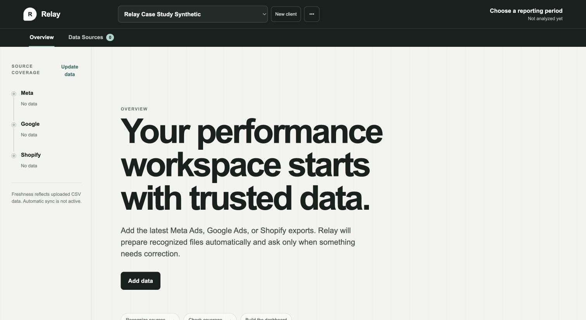
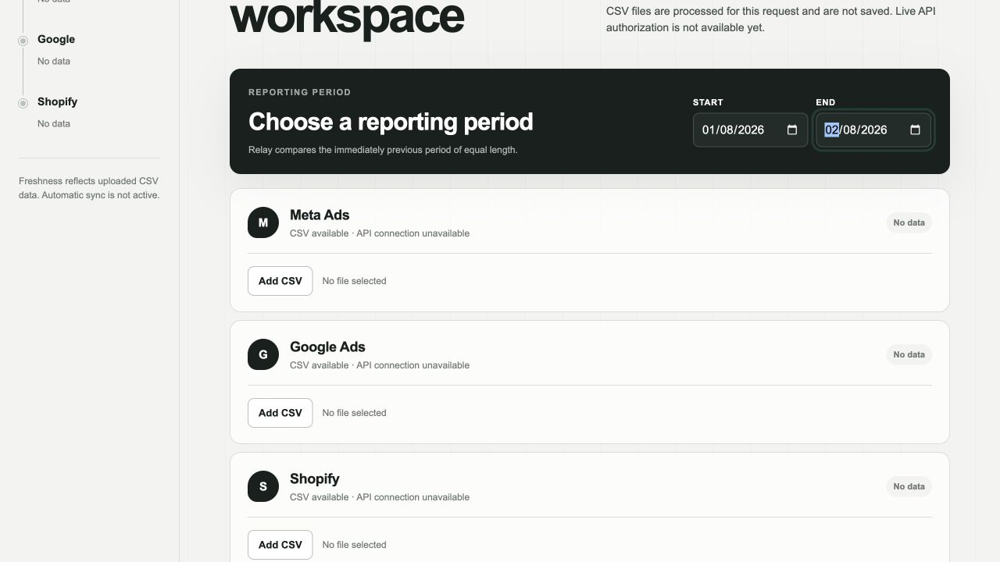

# Relay

> A deterministic performance workspace for freelancers and small agencies working from Meta Ads, Google Ads, and Shopify CSV exports.

Relay turns a reporting handoff that is often split across exports, spreadsheets, and slides into one browser-local workspace: import supported CSVs, inspect data quality, understand source-safe KPIs and change facts, then prepare a concise browser-printable report.

## Project status

Relay V1 is production-deployed as a **protected private beta**. It is intentionally not a public analytics service: V1 has no application accounts, database, cloud client persistence, live OAuth, automatic refresh, scheduled reports, email delivery, or generative-model dependency.

The protected production deployment is available at [Relay on Vercel](https://relay-9880vu2ib-raulmermans-projects.vercel.app/). Access is deliberately restricted through Vercel Authentication; this is a controlled portfolio demo/private-beta environment, not an invitation to upload production client data.

## The problem

Performance marketers need a quick, defensible answer to three questions: what happened, which source owns each fact, and whether the underlying data is trustworthy enough to use. Combining advertising-platform attribution with commerce revenue can make an attractive dashboard but a misleading one.

Relay is designed around that constraint. It makes the reporting path faster only when it can preserve the meaning of the supplied data.

## Workflow

1. Create or select a browser-local client and choose the reporting period.
2. Add one current CSV export per supported source: Meta Ads, Google Ads, and/or Shopify.
3. Resolve only mapping exceptions; Relay remembers valid non-sensitive configuration in the same browser.
4. Prepare the workspace. The server normalizes the supplied files in request memory and runs Data Health, KPI, Change Intelligence, and deterministic Narrative Intelligence once.
5. Review the dashboard, source coverage, evidence, and attention items.
6. Open the report preview and use the browser’s Print/Save-as-PDF control when the report is current and exportable.

## What makes the analysis trustworthy

- **Shopify is commerce truth.** Commerce Revenue, orders, AOV, and MER use Shopify facts only.
- **Provider attribution stays provider-specific.** Meta and Google attributed revenue, ROAS, and CPA remain attached to their own sources. Relay never sums provider-attributed revenue into Commerce Revenue.
- **Data Health gates interpretation.** Coverage, source expectations, currency compatibility, mapping, provenance, duplicates, and revenue semantics are surfaced before KPI and narrative use.
- **Narrative is deterministic.** It is composed from structured, inspectable facts; it does not call a generative AI service, infer causality, or recalculate KPIs.
- **Persistence is deliberately narrow.** Relay retains only versioned, bounded browser-local configuration and compact derived snapshots. Raw CSVs, filenames, canonical rows, provider payloads, tokens, credentials, and PDFs are not persisted.

## Architecture

```text
Meta Ads CSV ─┐
Google Ads CSV├─→ Normalization → Data Health → KPI Engine
Shopify CSV ──┘                                  ↓
                                   Change Intelligence
                                              ↓
                           Deterministic Narrative Intelligence
                                              ↓
                              Dashboard → Report Preview → Browser Print/PDF
                                              ↓
                               Browser-local client memory only
```

Future systems—live OAuth, automatic refresh, durable cloud persistence, application authentication, scheduled delivery, and generative AI—are intentionally outside V1.

## Verified production scenario

The protected production deployment was exercised with synthetic complete-workspace data:

| Fact | Verified value |
| --- | ---: |
| Shopify Commerce Revenue | €225 |
| Compatible Meta + Google spend | €55 |
| MER | 4.09× |
| Shopify orders | 2 |
| Meta ROAS | 2× |
| Google ROAS | 2× |

The same browser restored the named client and latest dashboard after reload. The report preview retained source-specific results and produced a six-page tagged A4 PDF through Chrome’s native print path. Freshness/coverage warnings were expected because the synthetic source data ended on 2026-08-02 while the exercised period extended to 2026-09-01.

## Screenshots

The following production screenshots use a named synthetic workspace only; no client export or report data is shown.



*Create a browser-local workspace before adding data.*



*Choose the reporting period and add one transient CSV export per source.*

## Local setup

Requirements: Node.js `24.14.x` and npm `11.9.x`.

```bash
npm ci
npm run dev
```

Open `http://localhost:3000`. Health is available at `http://localhost:3000/api/health`.

## Verification

The Sprint 17 release candidate completed:

- 304 Vitest tests across 42 files
- 209 unit tests across 26 files
- 95 integration tests across 16 files
- 48 Playwright checks across Chromium, WebKit, and Firefox
- lint, typecheck, production build, dependency audit, and diff check

Use the same release commands locally:

```bash
npm run lint
npm run typecheck
npm run test
npm run test:unit
npm run test:integration
npm run build
npm run test:e2e
npm audit --audit-level=low
git diff --check
```

## Deployment and access

Relay runs as a single Next.js project on Vercel with Node 24.x and no Relay-specific environment variables. The deployment is protected with Vercel Authentication; unauthorized visitors are redirected before the workspace loads. `GET /api/health` returns only `{ "status": "ok", "service": "relay" }` with `no-store` caching.

See [Vercel operations](docs/deployment/VERCEL.md) for deployment, access, and rollback details.

## Limitations

- Browser-local memory is not encrypted, synchronized, or recoverable after clearing site data.
- CSV refresh is manual; live provider authorization and background refresh are not active.
- Browser Print/Save-as-PDF layout and destination vary by browser and operating system.
- Public exposure requires a durable rate/abuse-control design; Relay remains protected until that decision is made.

## License

Relay is available under the [MIT License](LICENSE).

## Further reading

- [Product scope](docs/product/)
- [Data semantics](docs/data/)
- [Architecture and data flow](docs/architecture/DATA_FLOW.md)
- [Security policy](SECURITY.md)
- [Known issues](docs/release/KNOWN_ISSUES.md)
- [Private-beta contract](docs/release/PRIVATE_BETA.md)
